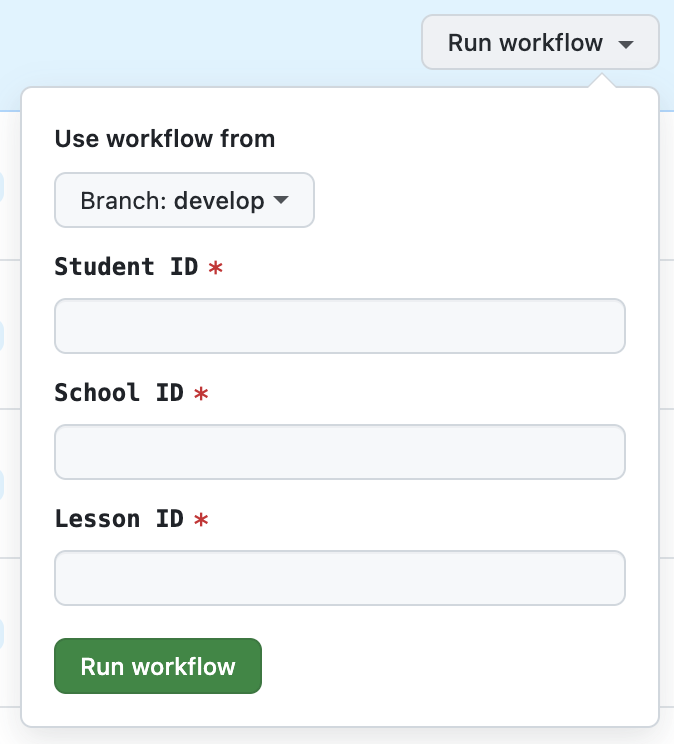

# Creating a new test session on Staging

To create a test session on staging, head to the [action page](https://github.com/ThirdSpaceLearning/prompty_library/actions/workflows/create_session.yaml), and click "Run Workflow"
.

Select:

- The branch related the prompt version (by default develop)
- Student ID
- School ID
- Lesson ID

And click `Run Workflow`

The action takes a few seconds to run, but the AI tutor needs a couple of minutes to join the session.

To run the session, just login on staging using the pupil set in the process.
