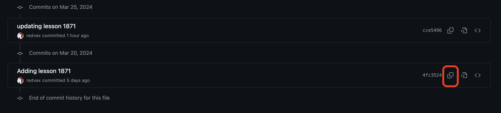

# Identify a version

To identify a version, the easiest thing to do is to use the branch name previously created. However, it's possible to point to any version by selecting the file and click "History". The version name can be copied from Github using the copy functionality:

.

PS. The version is an hash, something similar to (4fc35240680f444b61598db65dfcb9e3edd301e6).
