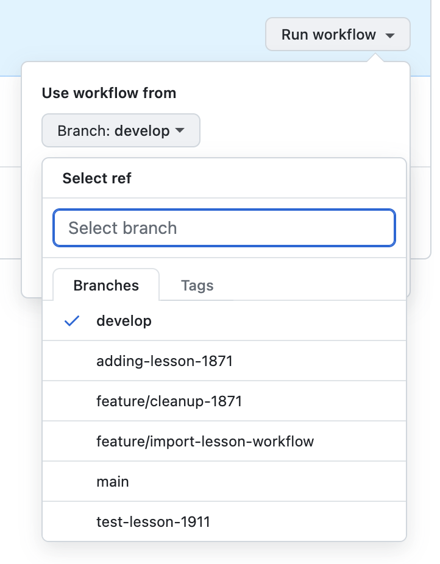

# Importing an existing lesson

Once the branch is created, head to the [action page](https://github.com/ThirdSpaceLearning/prompty_library/actions/workflows/import.yaml), and click "Run Workflow"
.

Select the branch where the learning object has to be imported and type the learning objective id to import.

The process takes arount 15/20 seconds to import a learning objective.
