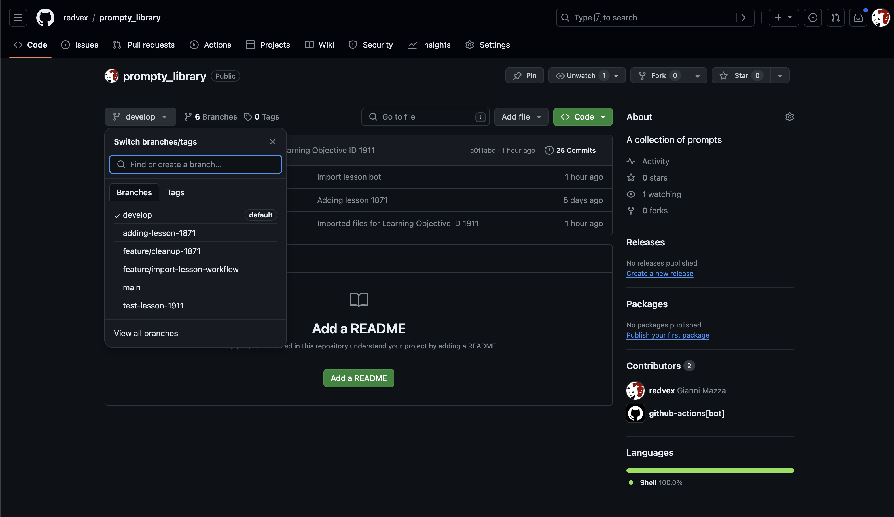

# Modify a version

To modify a version, select code and then branch
.
Then navigate to the [education/learning-objectives](../education/learning-objectives/) folder to start editing the prompt by selecting the file and click Edit.

To make the editor's life easier, each slide is tagged with its position.

It's important to notice that every single version is logged, it means, we can point Skye to use any version even if it's not immediately visible on github.
